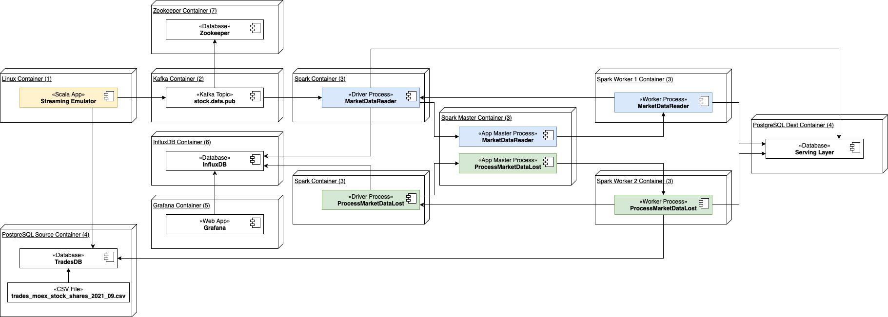

# market-data-loading-example

## Тема
Загрузка данных по биржевым котировкам акций

## Описание
В рамках данной проектной работы производися загрузка биржевых котировок в БД. В качестве источника используются исторические данные, полученные от Московской биржи. Пример данных - https://iss.moex.com/iss/downloads/securitygroups/stock_shares/collections/stock_shares_all/securities_stock_shares_all.csv.zip

Первоначально данные содержатся в CSV файле. При старте контейнера "PostgreSQL Source Container" данные из CSV файла импортируются в БД PostgreSQL. Для целей проектной работы предполагается разработать эмулятор потока данных на базе kafka, который будет читать данные из БД и загружать их в kafka topic. Таким образом будет реализован Streaming Source. Эмулятор потока данных поднимается в контейнере "Linux Container". Для реализации Batch Source будет использована исходная БД из контейнера "PostgreSQL Source Container". Предполагается, что на посточнной основе будет работать Spark Streaming приложение, в то время как Spark приложение, читающее данные из Batch Source будет запускаться вручную, в случае сбоев при работе Streaming приложения.

## Архитектура

## Список использованных образов
(1) - https://hub.docker.com/_/openjdk

(2) - https://hub.docker.com/r/bitnami/kafka/

(3) - https://hub.docker.com/r/bitnami/spark/

(4) - https://hub.docker.com/r/bitnami/postgresql

(5) - https://hub.docker.com/r/bitnami/grafana/

(6) - https://hub.docker.com/r/bitnami/influxdb
